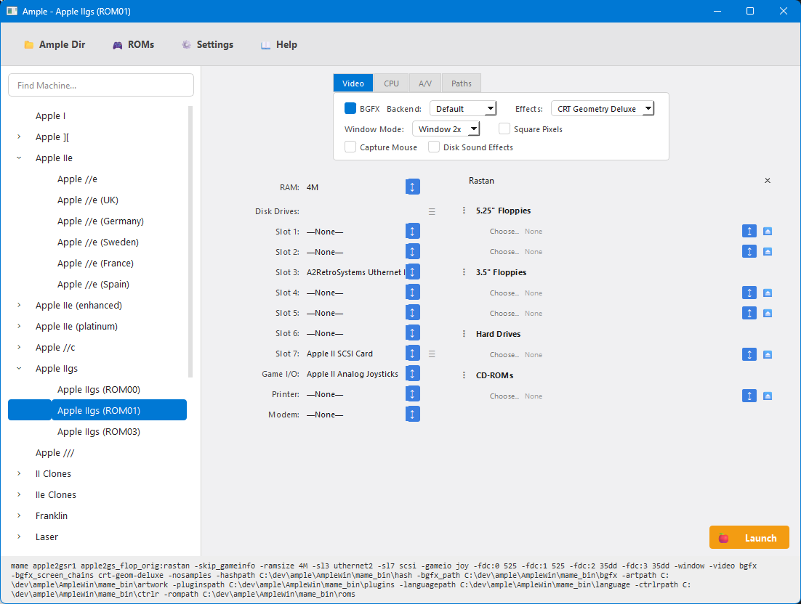

# AmpleWin - Windows Port (Legacy Apple Emulator Frontend)

[English](README.md) | [繁體中文](README_tw.md)

這是一個將 macOS 原生 [Ample](https://github.com/ksherlock/ample) 專案精準移植至 Windows 平台的版本。

> [!IMPORTANT]
> **架構說明**：Windows Port 的程式碼是基於 Python 與 PySide6 (Qt) **完全重新開發且獨立運行**的。它與原始 macOS 版本（Objective-C）在程式碼層級上完全分開，開發過程中**未修改任何 macOS 版本的原始碼**，僅共享了最重要的機器定義資源（.plist）。

## ⚔️ Ample (macOS) vs. AmpleWin (Windows) 完整對照表

| 功能項目 | Ample (macOS 原生版) | AmpleWin (Windows 優化版) | 優化重點與說明 |
| :--- | :--- | :--- | :--- |
| **程式語言** | Objective-C (Cocoa) | **Python 3.11 + PySide6 (Qt)** | 獨立開發，**完全沒動到 Mac 版原始碼** |
| **安裝方式** | .dmg 映像檔 / Homebrew | **免安裝綠色版 (+ .bat 自動配置)** | 透過 `AmpleWin.bat` 一鍵搞定 Python 與依賴 |
| **UI 介面** | macOS 原生組件 | **1:1 像素級 QSS 複刻** | 在 Windows 實現 **Adaptive 自適應淺色/深色主題** |
| **MAME 整合** | 內建客製版核心，或自選客製版本 | **額外下載官方版核心，或自選客製版本** | 使用者可隨時更新 MAME 核心，若無亦可選擇額外下載 |
| **初始機器選擇** | 支援預設書籤 (需手動設定) | **全自動持久化 (自動載入上次狀態)** | Mac 版需設為預設書籤，Windows 版則全自動開啟 |
| **軟體清單效能** | 同步加載 (解析完整 XML) | **延遲遞增加載 (Deferred Loading)** | **重大優化**：切換機器秒開，搜尋才加載，效能更佳 |
| **軟體搜尋 UI** | 標準列表 (Pop-up) | **智慧搜尋疊層 (Smart Overlay)** | 支援即時搜尋、全名顯示，且不推擠其他 UI 元素 |
| **ROM 下載** | 支援自動下載 (補齊缺失) | **支援自動下載 (多線程加速)** | 兩平台均可補齊韌體，Windows 版採並行下載更迅速 |
| **參數驗證** | 依賴 .plist 靜態定義 | **動態查詢驗證 (Live Validation)** | **重大優化**：自動與 MAME 比對，防止指令報錯崩潰 |
| **Video 支援** | Metal / OpenGL / BGFX | **BGFX / OpenGL / Vulkan / D3D11 / D3D12** | 針對 Windows 環境最佳化，支援多代 DirectX 核心 |
| **網路連線** | Apple VMNet Framework | **Npcap (WinPcap) / PCAP** | 使用標準 Npcap 即可上網 (無須權限修復) |
| **操作邏輯** | 支援黏性軟體選取 | **支援黏性軟體選取 (Sticky Selection)** | 兩平台皆支援切換機型後保留相容的軟體選取 |

## 🌟 核心功能

### 🍏 忠實還原 Mac 體驗 (功能對齊)
*   **視覺精準度**： 
    *   **高解析度縮放**：精準支援 **Window 1x-4x** 模式，並內建機器專屬的比例啟發邏輯（如 Apple II 4:3 修正）。
    *   **正方形像素 (Square Pixels)**：支援特製的整數縮放模式 (如 1120x768)，消除像素閃爍。
*   **軟體資料庫**：
    *   **智慧過濾**：自動識別機器支援的媒體類型 (flop1, flop2, cass...)，確保啟動參數與原始硬體一致。
    *   **搜尋遮罩**：完整還原 Mac 版的搜尋介面，支援自動補完與完整網格化清單顯示。
    *   **相容性檢查**：自動偵測屬性表中的 `disabled` 標記（如不相容的 SCSI 卡），並正確以灰色顯示不可選，與 Mac 行為一致。
*   **共享目錄 (Shared Directory)**：與 Mac 版功能完全對齊，支援透過 `-share_directory` 直接在主機與模擬器間共享檔案 (支援點擊輸入框瀏覽)。
*   **VGM 錄音支援 (進階)**：由於現代 MAME 已移除 VGM 支援，AmpleWin 實作了強韌的自動化工作流，可下載並平行配置 **MAME-VGM Mod (v0.280)**。透過非破壞性的解壓技術（保留原本的 `mame.exe` 並另存為 `mame-vgm.exe`），在不影響主核心的情況下完美還原錄音功能。

### 🪟 Windows 專屬優化與增強
*   **效能優化**：
    *   **併發下載系統**：多線程加速 ROM 下載，大幅縮短初始配置時間。
    *   **零雜訊 Workspace**：所有的 MAME 產出紀錄 (nvram, cfg, sta) 嚴格隔離在 `mame_bin` 內。
    *   **延遲載入 (Deferred Loading)**：大幅優化軟體清單載入速度，切換機器與搜尋皆可瞬間反應。
*   **UI 增強**：
    *   **適配主題**：即時同步 Windows 系統的深/淺色模式。
    *   **指令即時預覽**：底部的 4 行式 Console 欄位，可即時監控傳送給 MAME 的所有參數細節。
    *   **智慧路徑處理**：針對 A/V 輸出及共享目錄欄位提供原生的檔案/目錄選擇器，並自動執行路徑正規化 (將 `/` 轉為 `\`) 以確保與 Windows 的最佳相容性。
*   **彈性後端支援**：領先支援 BGFX、OpenGL、Vulkan 以及 Windows 專屬的 **DirectX 11/12**。

## 🛠️ 快速開始

1.  **啟動 Ample**：
    進入 **`AmpleWin`** 資料夾，執行 **`AmpleWin.bat`**。
    *   腳本會自動檢查 Python 環境、安裝依賴套件並啟動程式。
2.  **快速部署**：
    *   前往 **⚙️ Settings** -> 點擊 **Download MAME** 以自動配置模擬器。
    *   點擊主介面的 **🎮 ROMs** 以補齊系統韌體。
    *   點擊 **📂 Ample Dir** 可快速開啟程式安裝目錄。
3.  **開始體驗**：
    *   從左側列表中選擇想要的機器。
    *   **雙擊** 機器名稱或點擊右下角的 **Launch MAME** 即可啟動。

## 🌐 網路功能 (進階項目)

若要在模擬器中使用 **Uthernet II** 等網路卡硬體，在 Windows 環境下需要安裝 [Npcap](https://nmap.org/npcap/) (安裝時請勾選 "WinPcap compatible mode")。與 macOS 版本不同，Windows 是透過網卡驅動程式處理硬體存取，因此不需要額外的「權限修復 (Fix Permissions)」程序。

## 📂 Project Structure (專案結構)

| 檔案/目錄 | 說明 |
| :--- | :--- |
| **`AmpleWin.bat`** | **啟動腳本**。自動安裝依賴套件並執行主程式。 |
| `main.py` | 應用程式入口，處理 UI 渲染與主要邏輯。 |
| `data_manager.py` | 負責解析 `.plist` 機器定義檔與 MAME `.xml` 軟體列表。 |
| `mame_launcher.py` | MAME 指令建構器與執行序管理器。 |
| `rom_manager.py` | 系統 ROM 的管理與多執行緒下載引擎。 |
| `mame_downloader.py` | 自動化 MAME 核心與 VGM Mod 下載解壓工具。 |
| `mame_bin/` | 隔離的 MAME 工作目錄，存放執行檔、ROMs 與設定檔。 |
| `Agent.md` | 開發日誌與任務記錄。 |

## 📝 致謝

*   原始 macOS 版本開發者: [Kelvin Sherlock](https://github.com/ksherlock)
*   **Windows Port 開發者: anomixer + Antigravity**：致力於在 Windows 生態系中提供最極致的 Apple II / Macintosh 模擬體驗。
